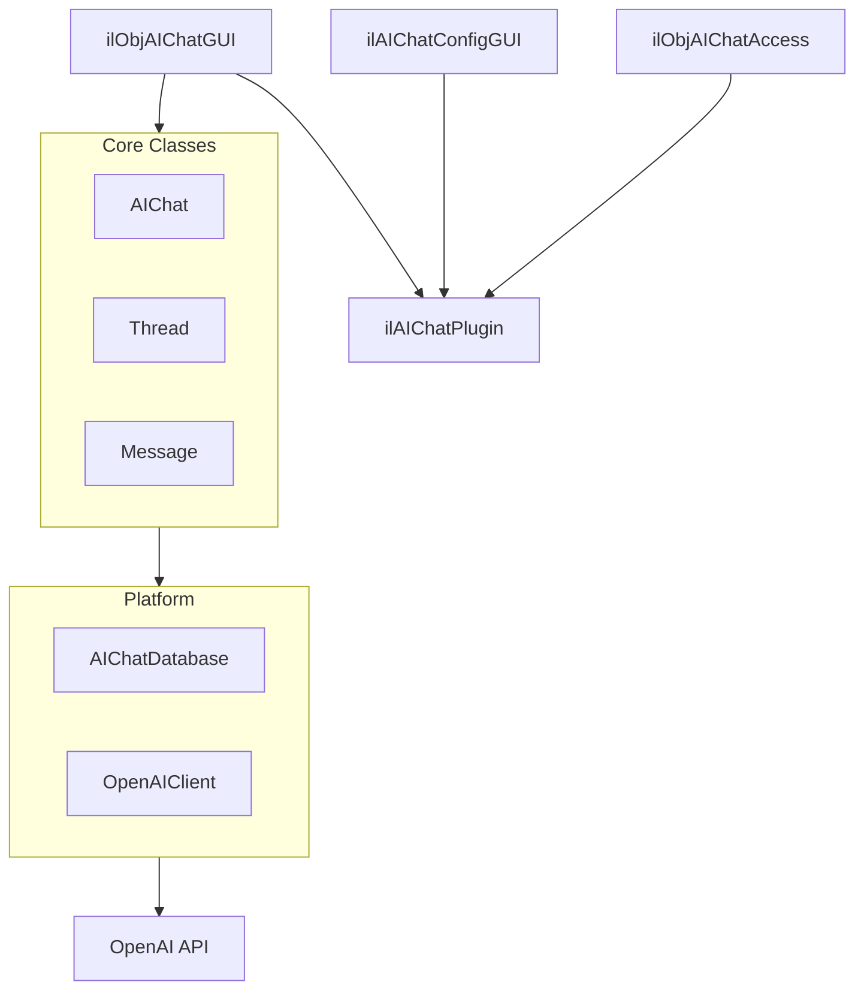
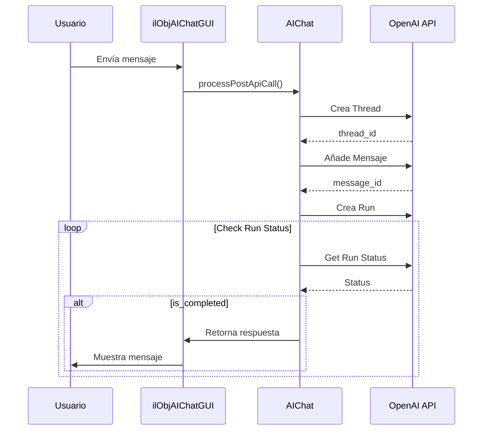
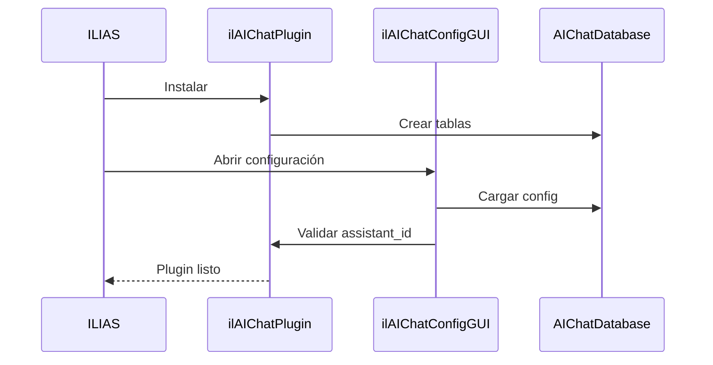

# Diagramas
## Sistema

```mermaid
flowchart TD
    UI[ilObjAIChatGUI]
    Plugin[ilAIChatPlugin]
    Config[ilAIChatConfigGUI]
    Access[ilObjAIChatAccess]
    
    subgraph Core[Core Classes]
        AIChat
        Thread
        Message
    end
    
    subgraph Platform[Platform]
        DB[AIChatDatabase]
        OAI[OpenAIClient]
    end
    
    UI --> Plugin
    UI --> Core
    Config --> Plugin
    Access --> Plugin
    Core --> Platform
    Platform --> External[OpenAI API]
```

## Flujo de Mensajes

```mermaid
sequenceDiagram
    participant U as Usuario
    participant GUI as ilObjAIChatGUI
    participant AC as AIChat
    participant OAI as OpenAI API

    U->>GUI: Envía mensaje
    GUI->>AC: processPostApiCall()
    AC->>OAI: Crea Thread
    OAI-->>AC: thread_id
    AC->>OAI: Añade Mensaje
    OAI-->>AC: message_id
    AC->>OAI: Crea Run
    
    loop Check Run Status
        AC->>OAI: Get Run Status
        OAI-->>AC: Status
        alt is_completed
            AC->>GUI: Retorna respuesta
            GUI->>U: Muestra mensaje
        end
    end
```
## Configuración

```mermaid
sequenceDiagram
    participant ILIAS
    participant Plugin as ilAIChatPlugin
    participant Config as ilAIChatConfigGUI
    participant DB as AIChatDatabase
    
    ILIAS->>Plugin: Instalar
    Plugin->>DB: Crear tablas
    ILIAS->>Config: Abrir configuración
    Config->>DB: Cargar config
    Config->>Plugin: Validar assistant_id
    Plugin-->>ILIAS: Plugin listo
```